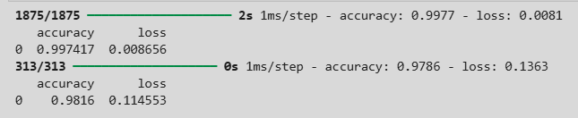
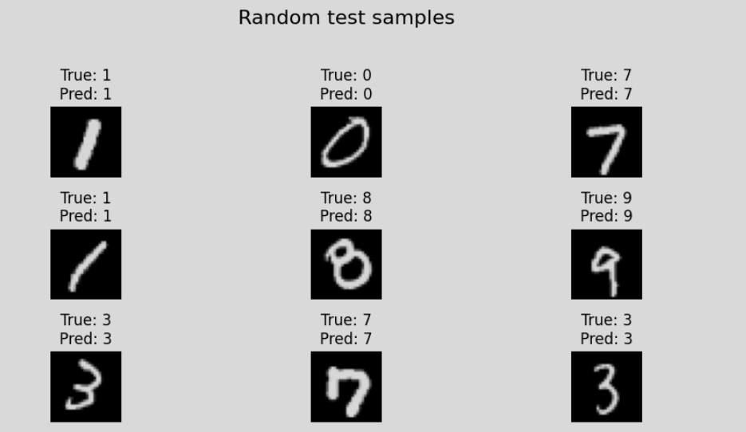
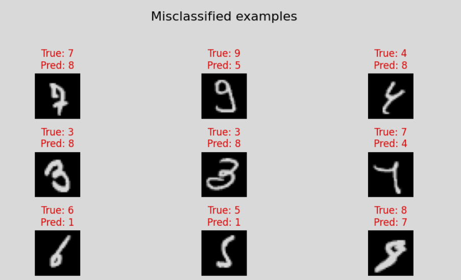

# ✍️ Hand-written Digit Recognizer

A TensorFlow project that trains a fully connected neural network to classify grayscale images of handwritten digits from the MNIST dataset. This repository contains the code, results, and visualizations demonstrating how a simple deep learning model can achieve high accuracy on a classic benchmark. 🚀

---

## 📖 Table of Contents

* 🧠 [Introduction to Neural Networks](#-introduction-to-neural-networks)  
* 📊 [Dataset](#-dataset)  
* 🏗️ [Model Architecture](#-model-architecture)  
* 🔄 [Training Process](#-training-process)  
* 📈 [Results](#-results)  
* ⚙️ [Setup and Usage](#-setup-and-usage)  
* 📚 [References / Resources](#-references--resources)  
* 🙏 [Thank You](#-thank-you)  

---

## 🧠 Introduction to Neural Networks

Neural networks are a family of machine learning models inspired by the human brain’s structure. They consist of layers of interconnected nodes (neurons) that transform input data through a series of weighted connections and nonlinear activations. The key components are:

1. **Neurons and Layers:** Each neuron computes a weighted sum of its inputs, adds a bias, and passes the result through an activation function (e.g., ReLU, sigmoid).
2. **Weights & Biases:** Trainable parameters adjusted during learning to minimize loss.
3. **Activation Functions:** Introduce nonlinearity, allowing networks to model complex patterns.
4. **Forward Propagation:** Data flows layer by layer, producing predictions.
5. **Loss Function:** Measures the gap between predictions and true labels (e.g., cross-entropy for classification).
6. **Backpropagation:** Computes gradients of the loss w\.r.t. weights using the chain rule.
7. **Optimizer:** Updates weights (e.g., Adam, SGD) based on gradients to minimize loss.
8. **Training Loop:** Iteratively processes batches of data, updating weights each epoch.

By stacking multiple layers (deep networks), neural networks can automatically learn hierarchical feature representations—from simple edges in early layers to complex shapes in deeper layers. This makes them highly effective for tasks like image classification, natural language processing, and more. 🌐

---

## 📊 Dataset

This project uses the famous **MNIST** dataset: 70,000 grayscale images (28×28 pixels) of handwritten digits (0–9).

* **Training set:** 60,000 images.
* **Test set:** 10,000 images.
* **Classes:** 10 (digits 0–9).
* **Preprocessing:** Pixel values scaled to \[0, 1] by dividing by 255.

Keras provides easy loading via `tf.keras.datasets.mnist.load_data()`, which returns NumPy arrays ready for model training.

---

## 🏗️ Model Architecture

Below is the summary of the Keras model :

(images/ModelSummary.png)

The network consists of:

* **Flatten** layer: 28×28 → 784 vector
* **Dense (256 units)** with ReLU activation
* **Dense (128 units)** with ReLU activation
* **Dense (128 units)** with ReLU activation
* **Dense (10 units)** (logits for each digit class)

Total trainable parameters: \~251,658. This simple feedforward network balances capacity and speed for MNIST.

---

## 🔄 Training Process

1. **Compile model** with:

   * **Optimizer:** Adam (lr=0.001)
   * **Loss:** SparseCategoricalCrossentropy(from\_logits=True)
   * **Metric:** Accuracy
2. **Train** for 20 epochs with batch size of 32.
3. **Shuffle** data each epoch for better generalization.
4. **Monitor** training & validation accuracy and loss.

By the 5th epoch, accuracy typically exceeds 95%, and by epoch 20 it approaches \~99% on training data.

---

## 📈 Results

### Training and Testing Accuracy



### Sample Predictions



### Misclassified Examples



The model achieves > 98% accuracy on the test set, misclassifying a small fraction of ambiguous digits.

---

## ⚙️ Setup and Usage

```
# Clone this repository
git clone <https://github.com/ApurvSardana/Hand-written-Digit-Recognizer.git>
cd <Hand-written-Digit-Classifier>

# Install dependencies
pip install tensorflow numpy matplotlib

# Run the notebook
jupyter notebook Notebook.ipynb
# or
jupyter lab Notebook.ipynb
```

Explore the code, tweak hyperparameters, or extend the model for better performance!

---

## 📚 References / Resources

* **TensorFlow API:** [https://www.tensorflow.org/api_docs/python/tf](https://www.tensorflow.org/api_docs/python/tf)
* **TensorFlow Tutorial Video:** [https://youtu.be/tPYj3fFJGjk?si=0bmtKXbO_z8-90XZ](https://youtu.be/tPYj3fFJGjk?si=0bmtKXbO_z8-90XZ)
* **Neural Networks:** [https://youtube.com/playlist?list=PLZHQObOWTQDNU6R1_67000Dx_ZCJB-3pi&si=L2tz7I6RCFse6pBw](https://youtube.com/playlist?list=PLZHQObOWTQDNU6R1_67000Dx_ZCJB-3pi&si=L2tz7I6RCFse6pBw)

---

## 🙏 Thank You

Thanks for checking out this project! Feel free to ⭐ the repo and reach out with questions or improvements. 🎉

Made by Apurv Sardana ❤️
